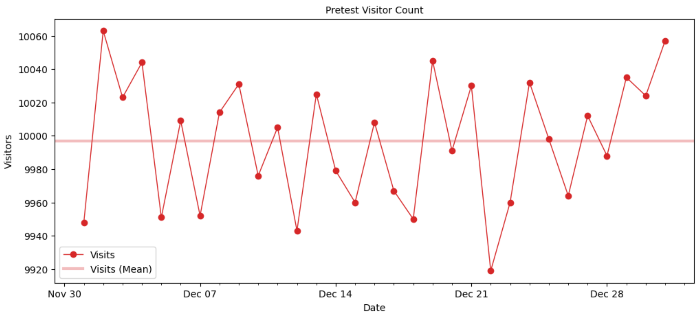
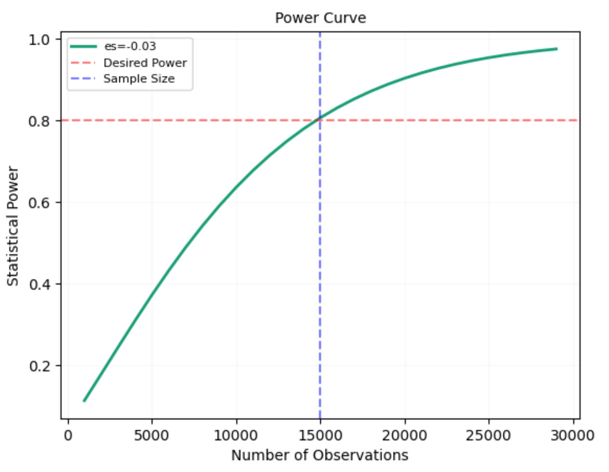

# Email Sign-Up Optimization: A/B Testing with Python

## Business Problem

CityFit, a clothing brand, is preparing to launch an eCommerce store. Currently, the pre-launch page is live, and its primary goal is to collect as many emails from visitors as possible for the upcoming launch. As a Product Data Scientist at Urban Wear, my task is to design, run, and analyze an A/B experiment that tests two versions of the email sign-up button on the pre-launch page.

- **Control:** The current red submit button. 🔴
- **Treatment:** A new green submit button. 🟢

The goal of this experiment is to help the product team at Urban Wear determine which version leads to higher email sign-up rates.

## Pre-Test Data Overview

To better understand the current performance, I first reviewed the pre-test data. This dataset contains the following variables:
- `visitor_id` (unique identifier of each visitor)
- `date` (visiting date)
- `email` (email address, `NaN` for not provided)
- `experiment` (AA_test, `NaN` for not assigned)
- `group` (0 = control, 1 = treatment)
- `submitted` (0 = No, 1 = Yes)

## Pre-Test Performance

The initial stats and the overall performance from the pre-test data before running the A/B test:
- **Number of rows in the table:** 309,903
- **Date range:** 2021-12-01 to 2021-12-31
- **Total visitors:** 309,903
- **Sign-ups:** 31,295
- **Sign-up rate:** 10%

### Pre-Test Metrics Insights
- **Visitors per day:** The site receives approximately 10,000 visitors each day.

- **Sign-up rate per day:** The daily sign-up rate hovers around 10%, ranging between 9.4% and 10.8%.

This understanding of the baseline performance and dataset helps me define a clear objective: improving the current 10% sign-up rate through the A/B test. 
By testing the red vs. green buttons, I aim to see if we can push this number higher.

## Business Objective

Before conducting any A/B test, it's crucial to fully understand the business objective. In this case, CityFit's objective is to increase the number of email sign-ups before the launch. By testing different submit button designs (red vs. green), we aim to identify which version increases user engagement, translating into more email submissions.

## Test Hypothesis

Next, we state the hypothesis for the experiment:

- **Null Hypothesis (Ho):** The sign-up rates of the red and green buttons are the same.
- **Alternative Hypothesis (Ha):** The sign-up rates of the red and green buttons are different.

We also set parameters for the experiment:
- **Significance Level (α):** Typically set to 0.05.
- **Statistical Power:** The probability of detecting a real difference when it exists, usually 80%.
- **Minimum Detectable Effect (MDE):** The smallest change in sign-up rates we aim to detect. We aim for a 10% MDE in this experiment.

## Experiment Design

Designing the experiment is critical to ensuring we collect sufficient data for accurate conclusions. In this case, we are testing the red submit 
button (control) against the green submit button (treatment) to measure the impact on email sign-up rates. The experiment design includes the following factors:

- ### Randomization

Visitors are randomly assigned to either the control or treatment group, which ensures there is no bias or systematic difference between the two groups. 
This randomness is key to isolating the effect of the button color on sign-ups.

- ### Sample Size 

To calculate the necessary sample size, I used Cohen’s D method to estimate the effect size. Based on the pretest data, 
I aimed to detect a 10% lift in sign-ups, improving the current 10% rate. Based on the calculated effect size and required sample size:
Each group will need 15,000 visitors, for a total sample size of 30,000, ensuring the test has enough sensitivity.

- ### Statistical Power

To achieve 80% statistical power (the probability of detecting a real difference when it exists), each group in the experiment will need 15,000 visitors, bringing the total sample size to 30,000. This ensures the test has enough sensitivity to detect a meaningful difference between the two button designs.

- ### Experiment Duration

The next step is determining how long to run the experiment to achieve the required sample size of 30,000 visitors (15,000 per group). 
The duration depends on the percentage of unique visitors allocated to the experiment and the average number of visitors to the pre-launch page.
We estimate the duration required based on different traffic allocation scenarios:

For a more balanced approach between risk and time, we plan to allocate around 20-30% of traffic, which leads to a test duration of 10-15 days.
Additionally, I calculated the number of users required per day for different experiment durations.

Given that a 14-day experiment balances risk and practicality (requiring around 2,143 users per day) while accounting for weekend effects, 
I will run the experiment for around 14 days. This duration allows enough time to gather the necessary data without risking too long a delay in decision-making.
By carefully choosing the traffic allocation and experiment duration, I ensure that the test will provide reliable results within a reasonable timeframe.

## Validity Threats
In any A/B experiment, it is crucial to ensure that the results are reliable and not affected by errors or biases. 
To address potential validity threats, we conducted an AA Test and also checked for Sample Ratio Mismatch (SRM).
### AA Test
The reason to perform an AA test is to ensure that our experiment setup did not have any issues. 
The AA test assigns users to two identical groups, allowing us to verify that the assignment mechanism and infrastructure are working correctly.
The sign-up rates for both groups during the AA test were as follows:
- **Control (Red Button):** 10.1%
- **Treatment (Red Button):** 9.88%

We ran a Chi-Square test to check for statistical significance between the two groups. The Chi-Square value 0.577 with P-value 0.448.
Since the P-value (0.448) was greater than our alpha level of 0.05, we failed to reject the null hypothesis (Ho). 
This means that there was no statistically significant difference between the two groups, and we can confidently 
proceed with the A/B test without worrying about instrumentation errors.

### Sample Ratio Mismatch (SRM)
The reason to perform a SRM is ensuring random assignment of samples. Sample Ratio Mismatch (SRM) occurs when the expected ratio of samples between the control and treatment groups is 
different from what is observed in the experiment. Ideally, in an A/B test, the ratio should be 1:1, meaning that both groups should have an equal number of users.

Pre-test sample allocations:
- **Control**:14,942
- **Treatment**:15,139
  
We conducted a **Chi-Square Goodness of Fit Test** to identify if the sample raito is significantly different than expected ratio of 1:1.
The result shows Chi-Square 1.29 with P-value 0.256. Since the P-value (0.256) was greater than 0.05, 
we failed to reject the null hypothesis (Ho). This indicates that there was no sample ratio mismatch, and both groups received a nearly equal number of visitors as expected.
By passing both the AA test and SRM test, we can confidently proceed to analyze the A/B test results without concerns about underlying validity threats.

## Step 5: Run the Experiment

Once the experiment is live, visitors are randomly assigned to either the control group (red button) or the treatment group (green button). 
During this phase, we monitor and collect data on the number of visitors and email sign-ups for both groups.
After gathering sufficient data, I calculated the sign-up rates for both the control and treatment groups:

- **Control Sign-Up Rate (Red Button):** 9.56%
- **Treatment Sign-Up Rate (Green Button):** 10.78%
To gain further insights, I calculated the daily sign-up rates for each group:
The average daily sign-up rates over the course of the experiment were:
•	Control Group (Red Button): 9.55%
•	Treatment Group (Green Button): 10.78%
These results indicate that the treatment (green button) consistently outperformed the control (red button), leading to a higher email sign-up rate during the experiment.

---

## Step 6: Conduct Statistical Inference
Now that the A/B test has been conducted, it's time to perform statistical inference. This step includes conducting both a Chi-Square Test and 
a T-Test for proportions, followed by calculating the Confidence Interval (CI) for the sign-up rate differences.
### Chi-Square Test

The Chi-Square test evaluates whether there is a statistically significant difference in the sign-up rates between the 
control group (red button) and the treatment group (green button).

The observed sign-up rates were:
•	Control Sign-Up Rate: 9.6%
•	Treatment Sign-Up Rate: 10.8%

The **Chi-Square test** confirmed statistical significance:
- **Chi-Square Statistic:** 12.312
- **P-Value:** 0.000 (significant)
  •	Significance Level (Alpha): 0.05
Since the P-value (0.000) is less than 0.05, we reject the null hypothesis (Ho), concluding that there is a statistically significant difference in sign-up rates between the red and green buttons.

### T-Test for Proportions
Next, we conducted a T-Test for proportions to further validate the results. The T-Test compares the sign-up rates between the control and treatment groups.
The results of the T-Test are:

The **T-Test** also confirmed the difference between the two groups:
- **T-Statistic:** 3.509
- **P-Value:** 0.000 (significant)
As with the Chi-Square test, the P-value (0.000) is below the significance level, so we reject the null hypothesis.
This further confirms that the difference in sign-up rates between the control and treatment groups is statistically significant.

### Confidence Interval (CI)

To quantify the difference between the sign-up rates, we computed the confidence intervals (CIs) for the absolute and relative differences between the two groups.
We calculated the **Confidence Interval** for the difference:
- **Absolute Difference CI:** (0.005, 0.019)
- **Relative Lift CI:** (5.7%, 19.9%)
This means that we are 95% confident that the true absolute difference in sign-up rates is between 0.5% and 1.9%, and the relative lift is between 5.7% and 19.9%.
Based on both the Chi-Square and T-Test, we can confidently reject the null hypothesis. There is a statistically significant difference in sign-up rates between the control (red button) and treatment (green button). The treatment group (green button) achieved a 12.8% lift in sign-ups, and the confidence interval for this lift is between 5.7% and 19.9%.

---

## Step 7: Decide Whether to Launch

The results over the two-week experiment (02/01/2022 - 02/14/2022) were:
- **Control (Red Button) Sign-up Rate:** 9.6%
- **Treatment (Green Button) Sign-up Rate:** 12.8%
- **Lift:** 3.2% improvement

Given both practical and statistical significance, I recommend launching the new green submit button to increase email sign-ups for Urban Wear.
After running the two-week experiment (02/01/2022 - 02/14/2022), we observed the following results:
•	Control (Red Button) Sign-up Rate: 9.6%
•	Treatment (Green Button) Sign-up Rate: 12.8%
•	Lift: 12.8% - 9.6% = 3.2% improvement
The results are statistically significant, with a 95% confidence interval ranging from 5.7% to 19.9%. Given both practical and statistical significance, we recommend launching the new green submit button to increase email sign-ups for Urban Wear.

---

This structured approach covers the end-to-end process of A/B testing, from defining the business problem to making a data-driven decision for implementation.
